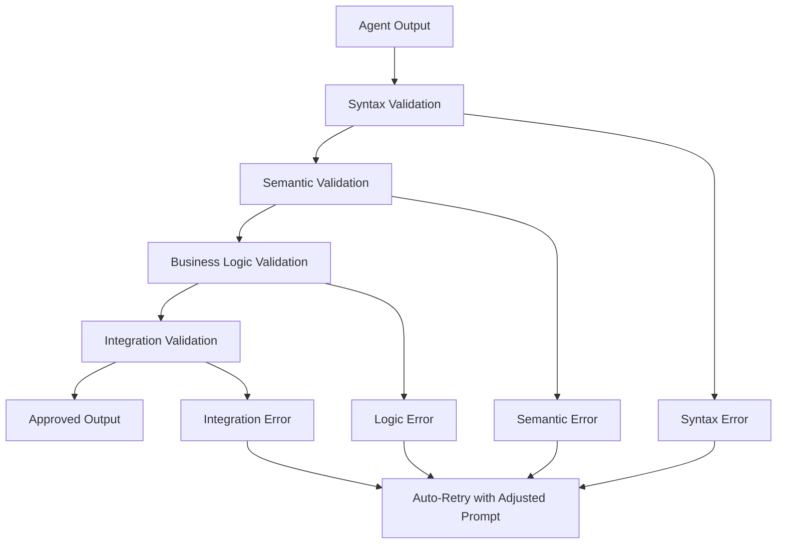

# 🛡️ Regression Prevention Architecture
## Preventing Vibe Coding Regressions in Multi-Agent Systems

### Overview
This document outlines the architecture and strategies to prevent "vibe coding" regressions - where AI models produce inconsistent or incorrect outputs due to prompt variations, model updates, or environmental changes.

---

## 🏗️ Architecture Components

### 1. **Test-Driven Agent Development (TDAD)**

```
┌─────────────────────────────────────────────────────────────┐
│                    Agent Development Lifecycle              │
├─────────────────────────────────────────────────────────────┤
│ 1. Define Expected Outputs (Test Cases)                    │
│ 2. Create Agent Implementation                              │
│ 3. Run Comprehensive Test Suite                            │
│ 4. Validate Against Golden Standards                       │
│ 5. Deploy with Monitoring                                  │
│ 6. Continuous Regression Testing                           │
└─────────────────────────────────────────────────────────────┘
```

### 2. **Multi-Layer Validation System**



### 3. **Golden Standard Repository**

```
tests/golden-standards/
├── structurizr-dsl/
│   ├── system-landscape-examples/
│   ├── container-diagram-examples/
│   ├── component-diagram-examples/
│   └── full-architecture-examples/
├── architecture-patterns/
├── cost-optimizations/
└── documentation-templates/
```

---

## 🧪 Test Categories

### A. **Unit Tests** (Agent-Specific)
- **Purpose**: Test individual agent functionality
- **Scope**: Single agent, controlled inputs
- **Examples**:
  - StructurizrDSLAgent produces valid DSL syntax
  - CostOptimizerAgent calculates accurate costs
  - DocumentationAgent generates required sections

### B. **Integration Tests** (Agent Interactions)
- **Purpose**: Test agent coordination and data flow
- **Scope**: Multiple agents, workflow scenarios
- **Examples**:
  - Requirements → Architecture → DSL pipeline
  - Cost optimization feedback loop
  - Documentation compilation from multiple sources

### C. **Regression Tests** (Stability Validation)
- **Purpose**: Prevent degradation of existing functionality
- **Scope**: Known-good scenarios, baseline comparisons
- **Examples**:
  - Weekly runs against golden standard examples
  - Model update impact assessment
  - Prompt engineering stability checks

### D. **Stress Tests** (Edge Case Handling)
- **Purpose**: Validate behavior under extreme conditions
- **Scope**: Large inputs, complex scenarios, error conditions
- **Examples**:
  - 100+ component architecture diagrams
  - Invalid input handling
  - Timeout and retry scenarios

---

## 🔧 Implementation Strategies

### 1. **Prompt Engineering Standards**

```typescript
interface PromptTemplate {
  systemMessage: string;
  userPromptTemplate: string;
  examples: PromptExample[];
  validationRules: ValidationRule[];
  fallbackPrompts: string[];
}

interface ValidationRule {
  type: 'syntax' | 'semantic' | 'business';
  rule: string;
  errorMessage: string;
  autoFix?: boolean;
}
```

### 2. **Output Validation Pipeline**

```typescript
class OutputValidator {
  async validate(output: string, expectedType: string): Promise<ValidationResult> {
    const validators = [
      new SyntaxValidator(),
      new SemanticValidator(),
      new BusinessLogicValidator(),
      new ConsistencyValidator()
    ];

    for (const validator of validators) {
      const result = await validator.validate(output, expectedType);
      if (!result.valid) {
        return result;
      }
    }

    return { valid: true, confidence: this.calculateConfidence(output) };
  }
}
```

### 3. **Continuous Integration Pipeline**

```yaml
# .github/workflows/agent-regression.yml
name: Agent Regression Tests

on:
  push:
    branches: [main, develop]
  schedule:
    - cron: '0 2 * * *'  # Daily at 2 AM
  workflow_dispatch:

jobs:
  test-agents:
    runs-on: ubuntu-latest
    steps:
      - uses: actions/checkout@v3
      
      - name: Setup Node.js
        uses: actions/setup-node@v3
        with:
          node-version: '18'
          
      - name: Install dependencies
        run: npm ci
        
      - name: Run agent unit tests
        run: npm run test:agents
        
      - name: Run integration tests
        run: npm run test:integration
        
      - name: Run regression tests
        run: npm run test:regression
        
      - name: Generate test report
        run: npm run test:report
        
      - name: Upload test artifacts
        uses: actions/upload-artifact@v3
        with:
          name: test-results
          path: test-results/
```

---

## 📊 Monitoring and Alerting

### 1. **Real-Time Monitoring**

```typescript
class AgentMonitor {
  private metrics: Map<string, AgentMetrics> = new Map();

  async trackExecution(agentName: string, input: any, output: any): Promise<void> {
    const metrics = this.getMetrics(agentName);
    
    // Track performance metrics
    metrics.incrementExecutions();
    metrics.trackLatency(Date.now() - input.timestamp);
    
    // Validate output quality
    const qualityScore = await this.assessOutputQuality(output);
    metrics.trackQuality(qualityScore);
    
    // Alert on degradation
    if (qualityScore < metrics.baselineQuality * 0.9) {
      await this.sendAlert(agentName, 'Quality degradation detected');
    }
  }
}
```

### 2. **Quality Metrics Dashboard**

```
Agent Quality Dashboard
├── Success Rate Trends
├── Output Quality Scores
├── Latency Percentiles
├── Error Rate by Category
├── Model Performance Comparison
└── Regression Test Results
```

---

## 🚨 Alert System

### Alert Triggers
1. **Test Failure**: Any test in the regression suite fails
2. **Quality Degradation**: Output quality drops below threshold
3. **Performance Regression**: Latency increases significantly
4. **Syntax Errors**: Invalid DSL or format outputs
5. **Integration Failures**: Agent coordination breaks down

### Alert Channels
- **Slack**: Immediate notifications for critical failures
- **Email**: Daily summary reports
- **Dashboard**: Real-time metrics visualization
- **PagerDuty**: On-call escalation for production issues

---

## 🔄 Maintenance Procedures

### Weekly Procedures
1. **Run Full Regression Suite**: Validate all agents against golden standards
2. **Update Golden Standards**: Add new high-quality examples
3. **Review Quality Metrics**: Analyze trends and patterns
4. **Model Performance Assessment**: Compare against previous weeks

### Monthly Procedures
1. **Comprehensive Test Review**: Update test cases for new features
2. **Prompt Engineering Audit**: Optimize prompts based on failures
3. **Architecture Review**: Assess system design effectiveness
4. **Documentation Updates**: Keep prevention strategies current

### Quarterly Procedures
1. **System Architecture Review**: Major design decisions
2. **Tool Stack Evaluation**: Consider new testing tools
3. **Process Improvement**: Streamline prevention workflows
4. **Training Updates**: Ensure team knows latest practices

---

## 📈 Success Metrics

### Quantitative Metrics
- **Test Coverage**: >95% of agent functionality covered
- **Regression Rate**: <2% monthly regression incidents
- **Mean Time to Detection**: <1 hour for quality issues
- **Mean Time to Resolution**: <4 hours for critical issues
- **False Positive Rate**: <5% for automated alerts

### Qualitative Metrics
- **Developer Confidence**: High confidence in deployments
- **User Satisfaction**: Consistent output quality
- **Maintenance Effort**: Manageable ongoing maintenance
- **System Reliability**: Predictable agent behavior

---

## 🛠️ Tools and Technologies

### Testing Frameworks
- **Jest**: Unit and integration testing
- **Playwright**: End-to-end testing
- **Artillery**: Load and stress testing
- **Custom Validators**: Domain-specific validation

### Monitoring Tools
- **Prometheus**: Metrics collection
- **Grafana**: Metrics visualization
- **Sentry**: Error tracking and alerting
- **DataDog**: APM and infrastructure monitoring

### CI/CD Pipeline
- **GitHub Actions**: Automated testing
- **Docker**: Consistent test environments
- **Azure DevOps**: Deployment pipelines
- **Terraform**: Infrastructure as code

---

## 🎯 Implementation Roadmap

### Phase 1: Foundation (Weeks 1-2)
- [ ] Implement core test infrastructure
- [ ] Create golden standard repository
- [ ] Set up basic validation pipeline
- [ ] Establish monitoring baseline

### Phase 2: Comprehensive Testing (Weeks 3-4)
- [ ] Build agent-specific test suites
- [ ] Implement integration tests
- [ ] Create stress test scenarios
- [ ] Set up automated test execution

### Phase 3: Monitoring & Alerting (Weeks 5-6)
- [ ] Deploy monitoring dashboard
- [ ] Configure alert systems
- [ ] Implement quality scoring
- [ ] Create escalation procedures

### Phase 4: Optimization (Weeks 7-8)
- [ ] Fine-tune alert thresholds
- [ ] Optimize test execution time
- [ ] Enhance quality metrics
- [ ] Document best practices

---

## 💡 Best Practices

### For Developers
1. **Write Tests First**: Create test cases before implementing agents
2. **Use Golden Standards**: Always compare against known-good outputs
3. **Validate Incrementally**: Check outputs at each stage of processing
4. **Monitor Continuously**: Track agent performance in real-time
5. **Document Everything**: Maintain clear documentation of expected behaviors

### For Operations
1. **Automate Everything**: Minimize manual intervention in testing
2. **Alert Responsibly**: Avoid alert fatigue with smart thresholds
3. **Trend Analysis**: Look for patterns in failures and degradations
4. **Capacity Planning**: Ensure testing infrastructure scales with system
5. **Regular Reviews**: Continuously improve prevention strategies

---

This architecture provides a robust foundation for preventing vibe coding regressions while maintaining system reliability and developer productivity.